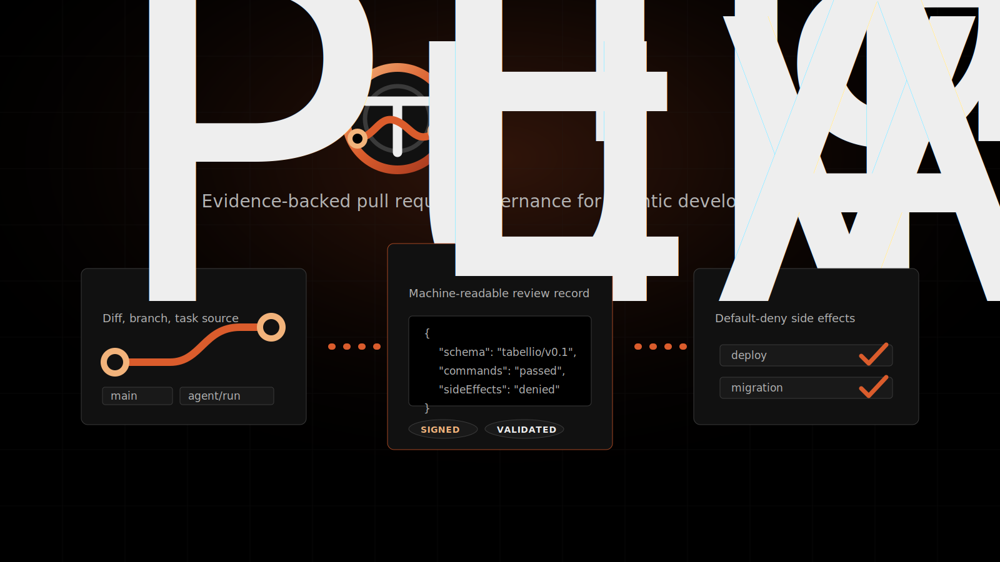

# Tabellio



[](https://scorecard.dev/viewer/?uri=github.com/IntelIP/Tabellio)
[](https://nodejs.org/)
[](https://github.com/features/actions)
[](https://json-schema.org/)
[](https://docs.oasis-open.org/sarif/sarif/v2.1.0/sarif-v2.1.0.html)
[](https://abhinav.github.io/git-spice/)
[](https://entire.io/)
[](LICENSE)

Provider-neutral Git context and evidence for agentic development.

Tabellio gives coding agents a deterministic Git foundation: standard Git repositories, isolated worktrees, immutable commit IDs, merge previews, compare-and-swap ref updates, and context packets tied to the exact diff. GitHub can store and review the result, but Tabellio's core does not need a GitHub API or a proprietary code-storage service.

## What It Adds

Tabellio attaches a structured evidence packet to a pull request. The packet is small enough to inspect in review and strict enough to validate in CI.

| Area | Evidence |
| --- | --- |
| Task | Source request, issue, ticket, or manual prompt summary |
| Git | Repository, base branch, head branch, commit SHA, and PR metadata |
| Runtime | Human, CI, or agent runtime that produced the change |
| Diff | Changed files |
| Validation | Commands run and check results |
| Approvals | Required, granted, denied, or skipped approvals |
| Side effects | Deployment, migration, infra, billing, secret, provider, and destructive-action policy |
| Artifacts | Evidence files generated by the run |

## Native Git Foundation

The native engine runs through the installed `git` executable. It never constructs shell commands.

| Component | Role |
| --- | --- |
| `GitProcess` | Executes argument arrays with prompts disabled and typed failures |
| `RepositoryStore` | Provider-neutral repository contract |
| `NativeGitStore` | Reads commits and diffs, manages worktrees, previews merges, and updates refs safely |
| `WorkspaceManager` | Gives each agent run a contained worktree path |
| Context packet | Binds task, actor, exact commits, changed files, checkpoints, and merge status |
| Agent-run CLI | Orchestrates start, checkpoint, validation, status, and safe promotion |

## Review Questions

AI-assisted pull requests should not depend on reviewer trust alone. Tabellio gives reviewers a repeatable answer to:

- What changed?
- Why did it change?
- What commands ran?
- What failed or was skipped?
- Did the workflow try to deploy, migrate, read secrets, touch billing, or mutate infrastructure?
- Where is the machine-readable audit packet?

## Workflow Stack

| Layer | Tooling | Role |
| --- | --- | --- |
| Runtime | [Node.js 20+](https://nodejs.org/) | Runs the local writer and validators |
| CI | [GitHub Actions](https://github.com/features/actions) | Hosts the reusable pull request evidence workflow |
| Evidence contract | [JSON Schema](https://json-schema.org/) | Validates the evidence envelope and external-action policy |
| Security signal | [OpenSSF Scorecard](https://securityscorecards.dev/) | Publishes a non-gating public repository health signal |
| Code scanning output | [SARIF](https://docs.oasis-open.org/sarif/sarif/v2.1.0/sarif-v2.1.0.html) | Carries Scorecard output into GitHub code scanning |
| Review surface | [GitHub Pull Requests](https://github.com/features/code-review) | Shows checks, artifacts, and reviewer context |
| Stacked review | [git-spice](https://abhinav.github.io/git-spice/) | Host-agnostic stack engine for small dependent change requests |
| Checkpoint ledger | [Entire](https://entire.io/) and [Entire CLI](https://github.com/entireio/cli) | Intended companion for agent session and checkpoint context |
| Git substrate | Standard Git CLI, bare repositories, and worktrees | Stores repositories, branches, commits, patches, and agent-created code state |
| Agent review | [OpenAI Codex](https://openai.com/codex/) | Optional review layer when configured |
| Prior art | [SLSA](https://slsa.dev/) and [in-toto](https://in-toto.io/) | Inspiration for provenance and supply-chain evidence, without a compliance claim |

GitHub remains an optional storage, CI, and review surface. Entire, git-spice, and Codex remain separate integration layers.

## Core Files

| Path | Purpose |
| --- | --- |
| `.github/workflows/tabellio-evidence.yml` | Optional GitHub adapter for context and evidence |
| `.github/workflows/scorecard.yml` | Non-gating OpenSSF Scorecard scan |
| `schemas/` | Evidence and external-action JSON schemas |
| `scripts/providers/native-git-store.mjs` | Standard Git storage provider |
| `scripts/providers/git-spice-stack-manager.mjs` | Read-only git-spice stack adapter |
| `scripts/lib/` | Git process, repository contract, worktree, and context primitives |
| `scripts/` | Dependency-free capture, writer, and validators |
| `examples/` | Minimal valid evidence fixture and consumer workflow example |
| `templates/` | Pull request checklist for evidence-backed review |
| `docs/` | Setup, schema, workflow model, Codex review, tooling stack, and research grounding |

## Quick Start

Add Tabellio to another repository:

```yaml
name: Tabellio Evidence

on:
  pull_request:

permissions:
  contents: read
  actions: read

jobs:
  evidence:
    uses: IntelIP/Tabellio/.github/workflows/tabellio-evidence.yml@main
    with:
      # Replace with the repository's normal validation command.
      validation_command: npm test
      toolkit_ref: main
```

`toolkit_ref` is required when the consumer repository does not vendor the Tabellio scripts. The example uses `main` while native context capture is unreleased. For production, pin both references to the same release tag or immutable commit SHA containing this feature.

Validate the bundled fixture:

```bash
node scripts/check-tabellio-evidence-envelope.mjs --evidence examples/tabellio-evidence/minimal-evidence.json
node scripts/check-tabellio-external-actions.mjs --evidence examples/tabellio-evidence/minimal-evidence.json
```

Generate evidence from the current Git state:

```bash
node scripts/write-tabellio-evidence-envelope.mjs --out tabellio-pr-evidence.json
node scripts/check-tabellio-evidence-envelope.mjs --evidence tabellio-pr-evidence.json
node scripts/check-tabellio-external-actions.mjs --evidence tabellio-pr-evidence.json
```

Capture provider-neutral context first, then bind evidence to it:

```bash
node scripts/capture-tabellio-context.mjs \
  --repo . \
  --repo-id IntelIP/Tabellio \
  --base main \
  --head HEAD \
  --out tabellio-context.json
node scripts/check-tabellio-context.mjs --context tabellio-context.json
node scripts/write-tabellio-evidence-envelope.mjs \
  --context tabellio-context.json \
  --out tabellio-pr-evidence.json
```

Run the local agent lifecycle:

```bash
node scripts/tabellio-run.mjs start \
  --run-id run-42 \
  --repo . \
  --base main \
  --task-summary "Add deterministic import validation"

# Edit and commit inside the returned workspace path, then:
node scripts/tabellio-run.mjs checkpoint --run-id run-42 --repo . --summary "Implementation committed"
node scripts/tabellio-run.mjs finish --run-id run-42 --repo . -- npm test
node scripts/tabellio-run.mjs promote --run-id run-42 --repo .
```

See [Agent run lifecycle](docs/agent-run-lifecycle.md) for state and failure behavior.

Package scripts:

```bash
npm run check
npm run tabellio:run -- status --run-id run-42
npm run tabellio:run:example:check
npm run tabellio:stack -- --repo . --repo-id IntelIP/Tabellio --out tabellio-stack.json
npm run tabellio:stack:check
npm run tabellio:context:capture
npm run tabellio:context:check
npm run tabellio:evidence:write
npm run tabellio:evidence:check
npm run tabellio:external-actions:check
```

## Protected Action Classes

These actions require explicit approval before attempted execution:

- deployment
- database migration
- infrastructure change
- DNS or hosting change
- billing or live-money action
- credentialed provider read
- secret-value read
- destructive workspace action

The external-action checker fails when an action is marked `attempted: true` without `approved: true`.

## Docs

- [Getting started](docs/getting-started.md)
- [Agentic tooling stack](docs/tooling-stack.md)
- [Agent run lifecycle](docs/agent-run-lifecycle.md)
- [Workflow model](docs/workflow-model.md)
- [Native Git foundation](docs/native-git-foundation.md)
- [Evidence schema](docs/evidence-schema.md)
- [Codex review](docs/codex-review.md)
- [Research grounding](docs/research-grounding.md)
- [Brand system](docs/brand.md)
- [Security policy](SECURITY.md)
- [Contributing](CONTRIBUTING.md)
- [Changelog](CHANGELOG.md)

## License

Apache-2.0. See [LICENSE](LICENSE) and [NOTICE](NOTICE).
